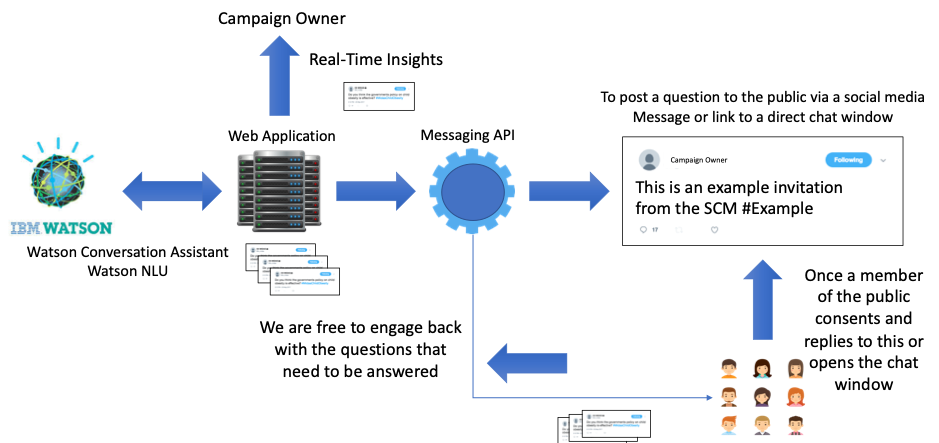
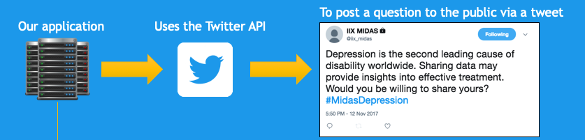
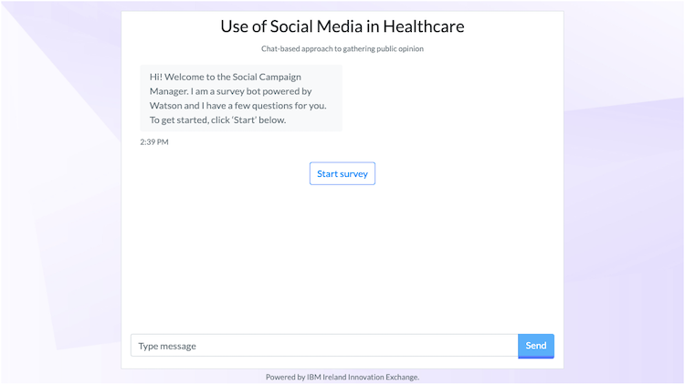
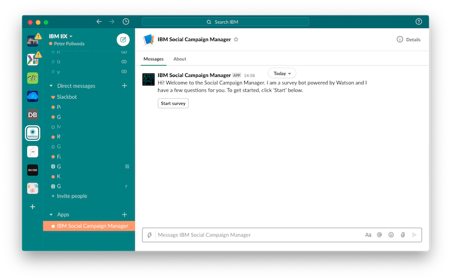

­

IBM Ireland **Cloud & AI Foundry**

**Table of Contents**

[Introduction](#introduction)

[Systems architecture](./systems-architecture.md)

[Data persistence](./data-persistence.md)

[Testing and risk mitigation](./testing-and-risk-mitigation.md)

[APIs](./apis.md)

[Usage demo](./usage-demo.md)

Introduction
============

The Social Campaign Manager's (SCM) main goal is to "capture the voice
of the public". The application is suitable in any use case where
stakeholders wish to gather input from members of the public or a target
cohort of people. Typically, this is done through polls, surveys and
public consultations, which take a lot of time, money and effort to
establish and run. They also have a potential risk of being biased if
all sides are not adequately represented. This has brought about a drive
to find a more open and inclusive way of capturing the voice of the
public, but this typically comes at a high cost of having a lot of staff
spending time talking face-to-face with members of the public, and
manually recording and analysing the results. Social media and analytics
offer a solution to this, if implemented correctly, by allowing anyone
with a free social media account to voice their opinions and having a
system in place to aggregate them and highlight key points of interest.

The SCM looks to try to improve on this by using cognitive solutions to
drive conversation and provoke reactions in a free form manner not
restricted by multiple choice answers, allowing members of the public to
truly express their opinions. Using a combination of Natural Language
Understanding techniques, these responses will be analysed and displayed
on a dashboard creating an actionable set of insights.

Although this prototype application was built in collaboration with
health care policy makers it could be used by any stakeholder who wants
to capture information using Q&A style engagements over social media or
via a direct messaging service with their following.

Figure 1.1 The Social Campaign Manager Overview

Social Media and Direct Messaging Data Sources
==============================================

The Social Campaign Manager (SCM) allows any stakeholder to create a
campaign that will be run via social media. Twitter was chosen as the
initial social media platform to act as the user interface as it has a
very large user base and it gives the public a way to voice their
opinions. This is a good fit for the SCM. It gives the policy maker
access to their target audience and the public have a modern, familiar
way to respond with their opinion. When a campaign is launched through
the social dashboard, the chatbot uses a Twitter account to send out a
descriptive, initial Tweet about the topic. The public are invited to
respond with their opinion through private direct messages to the
Twitter account. As the chatbot is a software service it needs a
programmatic way to handle this interactivity. Twitter provides a
development toolkit to do this. Tweets, Tweet responses and private
direct messages can be automated using Twitter's API.

Figure 2.1 The Social Campaign Manager uses
Twitter to consult public opinion

Other campaign data sources
===========================

Alternatively, the SCM can be connected to an alternative direct messaging service e.g. Slack, SameTime, Facebook etc. To demonstrate how this could look and to also provide the logic that connects front with backend in the SCM a demonstrator generic chat window has been implemented. The window provides the functionality to implement a direct messaging service to ask and answer questions. This capability has been provided as a demonstrator without consideration of security, authentication or encryption that might typically accompany a direct messaging service. The reason for this is that the design and implementation of these features is heavily dependent on the system to which it is integrating and being deployed within and owner/user requirements. The application owner should consider and implement these requirements carefully for their use case of the SCM.

Figure 2.2 Direct chat window

Figure 2.3 Slack messaging implementation example

The SCM includes a number of examples of messaging platforms' implementations using a standardised provider mechanisms which can be used simultaneously. Input from all sources is integrated on the campaign dashboard where responses from multiple sources can be seen together.

