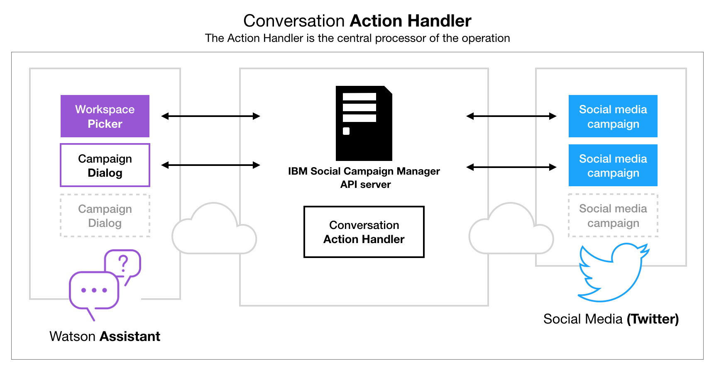

**Table of Contents**

[3.1 High level diagram](#high-level-diagram)

[3.2 Adapters](#adapters)

[3.3 Watson](#watson)

[3.4 Alternative conversation assistant services](#alternative-conversation-assistant-services)

[3.5 Watson Assistant Concepts](#_Toc36021061)

[3.6 Conversation Action Hander](#conversation-action-hander)

[3.7 Direct Message Processing Flow](#direct-message-processing-flow)

[3.8 Workspace Picker](#workspace-picker)

[3.9 Campaign Dialog Tree](#campaign-dialog-tree)

Systems architecture­
=====================

High level diagram
------------------

Figure 3.1 below is an architectural diagram of the SCM. Data analysis
requires creating, running and maintaining a campaign.

Figure 3.1 Social Campaign Manager --
High-level architecture diagram

The other elements of the architecture will be discussed in the
following sections.

Adapters
--------

The Social Campaign Manager API application service is built using a
concept of data adapters. These adapters handle differences in the
various social media APIs and transform the data coming from the various
data sources into a common data model used by the platform. This allows
the layers above to simply deal with the resulting data and not need
unique logic for each platform. The Twitter social media data adapter is
the first of a series of data adapters that can be implemented into the
application. What's worth noting is that a single social media adapter
already provides an unlimited number of data inputs through externally
facing campaigns.

The application also supports a direct messaging chat form prototype.
The direct chat system is implemented in the same way as the twitter
data adapter. The consolidated responses from all endpoints are
displayed on the campaign dashboard.

Watson
------

IBM's Watson provides the cognitive and natural language services that
run the chatbot and perform the analysis. Using the Watson provide the
resources out of the box to build chatbots and analyse the responses
that didn't require training, experimentation, maintenance or developer
operations (DevOps) to get up and running.

Two independent Watson services were used:

1.  **Watson Assistant**[^assistant] - Provides a web based GUI and API to allow
    the training of Natural Language Classifiers to determine a user's
    "Intent" from their message. It also exposes a means to train a
    custom entity extractor, as well as having multiple in-built entity
    extractors for people's names, locations, times, currencies, etc.
    mentioned in the text. Finally, it provides a means of constructing
    a dialog tree with each node representing a message from a user and
    a response to provide. The dialog tree leverages the intents and
    entities to determine which nodes are visited next, allowing the
    business logic of the conversation to be abstracted away from the
    server-side code. It is important to note that this kind of control
    using APIs is not usually present in other equivalents and is vital
    in the current social campaign manager use case.

2.  **Watson NLU (Natural language understanding)**[^nlu] - Watson NLU is
    a collection of natural language processing services wrapped under
    one umbrella, allowing them all to be performed in one request and
    to work in tandem. Inside the NLU the application uses:

    a.  Sentiment analysis on the entire message.

    b.  Emotion analysis on the entire message.

    c.  5 level taxonomy categorization on the entire message.

    d.  Keyword extraction.

    e.  Sentiment analysis on each keyword.

    f.  Named entity extraction with optional disambiguation information
        if available.

    g.  Sentiment analysis on each entity found.

Alternative conversation assistant services
-------------------------------------------

There are a number of solutions on the market today that work in similar
ways that are both proprietary and open source. Open-source alternative
solutions include Rasa, Botkit or Botpress. These specialised APIs would
require a significant amount of resources to be manually built around
these services. Some alternative services also require training after
creating a conversation, which in case of the Watson Assistant Services
is done automatically after a conversation flow is created.

Watson Assistant Concepts
-------------------------

Here are four key concepts to understand before diving into the Social
Campaign Manager's campaign dialogs. Most virtual assistants (commonly
called chatbots) use similar concepts to drive their behaviour. In
Watson Assistant they are:

-   **Intent**: An intent represents the purpose of a user\'s input. An
    intent is defined for each type of user request the application
    needs to support. Intents in Watson Assistant are prefixed with a \#
    symbol, like in this example: \#greeting.

-   **Entity**: An entity represents a term or an object that is
    relevant to the intents that provides a specific context for an
    intent. Each entity and its values need to be listed in the tool
    together with synonyms the users might enter when talking about
    them. In Watson Assistant entities are prefixed with an @ symbol,
    i.e. \@research\_institutions. The tool also provides the user with
    a number of predefined *system entities* like a \@number or
    \@location to easily handle most common situations.

-   **Dialog**: A dialog is a branching conversation flow that defines
    responses to the defined intents and entities. The creator uses the
    dialog builder in the tool to create conversations with users to
    provide responses[^4]. A single assistant can have multiple skill
    dialogs associated with it.

-   **Context Variable**: a context variable is a user-defined variable
    that can be used to direct the conversation or pass a value
    throughout the conversation. Some context variables might hold
    entities picked by the user, intents or just plain text used later
    in the conversation context. These variables are very useful for
    example when the user already gave an answer to a question that
    might be asked next. Context variables in Watson Assistant are
    prefixed with a \$ sign, i.e. \$is\_why\_question.

Figure 3.2 Conversation context is kept in an
in-memory database

The context is how a campaign dialog navigates through the conversation
(shown above in Figure 3.1). It is a JSON object with Watson Assistant
system-related attributes i.e., which question node is the user
currently answering. In the Social Campaign Manager, the dialog context
is directly linked to the participant's Twitter account using the user
number of the account and saved in a REDIS in-memory database for quick
access. This way the Assistant is able to continue the conversation even
if the participant abandons the conversation for some time. A user
context session is updated in the memory store every time the
participant sends a message. It is programmatically set to last for 48
hours after the last update after which the conversation context is
deleted by the database. If the participant wishes to talk to the dialog
after it expires, the conversation restarts, which means they have to
start the conversation from the beginning.

The above concepts are used throughout the SCM when building a social
media campaign dialog. Each dialog employs all of the above concepts in
a number of ways explained in section 3.1.5 Campaign Dialog Tree.

Conversation Action Hander
--------------------------

The Social Campaign Manager (SCM) is an application built on top of two
microservices. The web application, which the policy maker manages his
or her social media campaigns, is connected to a service responsible for
the REST APIs (Application Programming Interfaces), henceforth called
the back-end service. REST, or REpresentational State Transfer, is an
architectural style for providing standards between computer systems on
the web, making it easier for systems to communicate with each other.
REST-compliant systems, often called RESTful systems, are characterised
by how they are stateless and separate the concerns of client and
server.[^5]

Figure 3.3 The Action Handler is where the
conversation is processed

The back-end is powered with a multitude of data-providers interacting
with services like the Watson Assistant for conversation capabilities or
the Twitter service dealing with sending and receiving requests from
social media. The integration of all these services is performed using
an Action Handler shown in the middle of the diagram above in Figure
3.2**.** The Action Handler operates as the middle-man between the
AI-powered dialogs and the user interactions on Twitter. It directs what
action needs to be performed next using available providers. Social
media interactions can be distilled into two categories: chat messages,
where the user is chatting with the application through instant
messaging (on Twitter called Direct Message or DM for short), and tweet
activities -- which are all other post specific actions like replies to
tweets, liking, retweeting, etc. The Action Handler is able to
distinguish between these types of activities and perform the required
action. In case of a response to a tweet, the Action Handler replies to
the potential participant with a link to a Direct Message conversation
with the campaign the tweet is linked to in the SCM system. If the
social media interaction turns out to be a DM, it processes the message
accordingly. The message-processing flow diagram can be seen explained
in detail further below.

The Action Handler also decides if the message needs to be analysed with
a Natural Language Understanding service or saved to the database as a
response to a campaign question. The system is also able to take into
account a certain number of special commands. In this case the message
does not need to be saved into the storage or analysed using the NLU
service.

Direct Message Processing Flow
------------------------------

Figure 3.4 (in landscape below) shows a use case diagram of the Social
Campaign Manager's chat capabilities. The study participant is able to
send messages during the direct message conversation that don't
necessarily relate to the question on hand. These can be the:

-   Basic special commands controlling the dialog - displayed in green
    in the diagram. Special commands are caught by the system which then
    does not send a request to the Watson Assistant Dialog.

-   Results and Findings (in blue) calculated from the aggregated
    responses from the database. These show answers to the questions in
    aggregated percentage form and sentiment analysis for the whole
    campaign respectively. These are specific types of special commands.
    The user can ask for these in a multitude of ways therefore the
    Watson Assistant Dialog is required to mark them as \#intents before
    the SCM server can provide the requested information.

-   Questions about the campaign itself (in black), also referred to as
    the Required Questions**,** because they are required to be entered
    when creating a campaign. Each campaign needs to provide information
    on the data collected, consent, people to contact in case of further
    enquiries by the participant, etc. The participant can ask these at
    any stage of the chat. Answers to these questions come directly from
    the Watson Assistant Dialog.

Figure 3.4 Twitter Data Provider automatically
replies to tweets related to a social media campaign

The Social Campaign Manager uses the Twitter data provider to listen to
requests from social media. Interactions like Direct Messages, Tweet
Likes, Retweets, Mentions, etc. are processed by the server - see Figure
3.3 above.

If the interaction request is a tweet reply, the system sends out an
automatic response to the person replying to the campaign tweet inviting
them to participate in the campaign. If the interaction is a direct
message it sends the message to the Action Handler to process its
content. Otherwise, in case of likes, retweets, etc. -- the interaction
is discarded by the system.

Figure 3.5 Use case diagram of optional in-chat
capabilities of the SCM showing which actor is responsible for which
capability

Figure 3.6 What happens when the system
receives a Direct Message (DM) from Twitter

The dialog flow diagram in Figure 3.5 above describes the processes of
reasoning which takes place whenever the system receives an instant
message from a social media chat.

The Action Handler processes a Direct Message by first checking for the
in-chat capabilities mentioned above. Before the message is sent to
Watson Assistant, it is scanned for quick text commands like 'start
again' or 'opt-out'. Quick commands like this don't need to be sent to
the virtual assistant for processing. They are built-in server commands
that handle application-wide commands like restarting the conversation.
The '*start again'* command for example is a type of "hard reset"
command destroying the conversation and letting the participant (or
developer) start over in case the dialog runs into an infinite loop. The
*opt-out* command marks the user's conversation for deletion if the
member of the public would like to withdraw consent to their collected
data.

A Direct Message is a JSON Object sent by the Twitter SDK which holds a
number of attributes. One of the attributes is the link the user clicked
to start the conversation. This link attribute is used to associate a
message with a particular social media campaign. If this happens, the
conversation is restarted, and the conversation is automatically linked
with the correct Watson Assistant Dialog without the participation of
the Workspace Picker. The Workspace Picker will be explained in detail
in section 3.1.4 Workspace Picker.

Messages are then sent to the appropriate dialog skill in the Watson
Assistant system. The dialog replies with a message containing:

-   A raw text response

-   context: this is where all of the up to date conversation context
    like recognised \#intents, \@entities or \$variables are kept

-   dialog nodes: a dialog node is a certain place in the conversation.
    This attribute can be used to manipulate the dialog programmatically
    from the server-side.

Based on the context attributes of the response message, the system
decides what is the next appropriate action. In case of a recognised
special command the command is performed immediately, after which the
system responds to the participant with the appropriate response.

The dialog message coming from the Assistant will generally be either a
question or a request to the user to provide some information. The
dialog is usually a one-to-one question answer exchange. Sometimes
though, the user types in an unexpected response or decides to ask a
question in response to a question instead of giving a straight up
answer. Luckily, Watson Assistant has a built-in intent feature called
\#anything\_else. Using this intent in conjunction with context
variables the chatbot is able to catch unrelated responses or as in the
above diagram, unrecognised answers. Both recognised and unrecognised
answers update the message context, however they end up stored in their
own respective places in the database for further analysis by the
researcher studying the campaign.

Determining the type of answer leads to the system performing semantic
analysis on the content of the raw text sent earlier by the participant.
The text is analysed with a Natural Language Understanding (NLU) service
to determine the sentiment and the emotional composition of the message.
The NLU is able to determine with confidence what levels of joy,
sadness, fear, anger or disgust are present in the participant's answer
and provide confidence levels deciding if the message is generally
positive, negative or if it is neutral.

The participant's response together with the NLU results are then saved
to the database and displayed as graphs in aggregated form on the
Campaign Detail Page.

The system also updates the user's context in the REDIS database and the
participants profile in the system's database, if required, in parallel
to speed up the bot response process. The profiles database collection
holds information if the conversation has been concluded, what is the
participant's estimated location and basic profile and demographic
information.

Workspace Picker
----------------

Figure 3.7 Workspace Picker is a special type
of Watson Assistant Dialog

The Social Campaign Manager uses Watson Assistant dialog skills to
perform operations based on the participants' actions; each campaign
therefore is a dialog. The Workspace Picker (shown in context in Figure
3.6) is also a dialog skill. It is updated every time a campaign is
created or deleted. The reason for this is to let a single Twitter
account hold multiple campaigns at a time. If a person decides to
message the account directly instead of clicking a link in a tweet, it
decides which social media campaign the participant participates in. The
Workspace Picker links the currently available campaigns with its own
intents. Each campaign therefore can be selected by the user in a free
form conversational way. Every instance of a Social Campaign Manager
needs to have a single Workspace Picker. This way the system always
knows which campaign dialog the participant is going to talk to.

Figure 3.8 Use case diagram of the Workspace
Picker decision making

The above diagram (Figure 3.7) demonstrates what happens when the Social
Campaign Manager receives a message. Each time an instant message is
received, the SCM checks the user context database for an existing
dialog context. The system looks for an existing campaign intent linked
to the Twitter user number. If the context does not exist in the memory
store, the SCM sends a message to the workspace picker to list out the
currently available campaigns (workspaces).

Once the user picks a campaign the Workspace Picker sends appropriate
intent confirmation to the Social Campaign Manager back-end server. The
SCM then starts the conversation with the appropriate dialog skill.

Campaign Dialog Tree
--------------------

Creating a social media campaign in the Social Campaign Manager creates
a skill (also called a workspace) in Watson Assistant. A skill is made
up of intents, entities and a dialog. The dialog is displayed in a form
of a tree containing nodes directing the conversation with the aid of
intents, entities and context variables. Figure 3.8 below demonstrates a
basic representation of a typical dialog tree found in the SCM. The
conversation begins with the conversation assistant sending a welcome
message to a campaign participant. After that the consent question and
the demographics question and finally the campaign questionnaire starts.

Figure 3.9 A simplified representation of the
campaign dialog tree

The dialog starts off by displaying a welcome message to the participant
with a pre-defined greeting and consent message. The welcome message
uses a context variable **\$name** which is defined when the participant
first messages the SCM from Twitter. The system uses the name found in
the participant's user profile to personalise the response as seen in
Figure 3.9 below.

Figure 3.10 Watson Assistant Welcome Message

The welcome message will be sent to the user if the assistant recognises
the intent to **\#welcome** or if the context variable
**\$from\_public\_message** is populated by the system. This variable is
set to 1 when the participant clicks the link in a tweet mentioned in
3.1.3 and in the message processing diagram in Figure 3.1.

Figure 3.11 Twitter direct message with name
variable populated

Each node continues on to its following child node, if any are present.
Otherwise it stops the dialog conversation on the level it is at and
listens for the user input before continuing. Dialog nodes can also be
made to stop and listen for user input before continuing at each
internal level. This is where the dialog looks for intents, entities and
context variables to decide which child node to process next. The first
example of this is the Consent Question displayed in Figure 3.8 above.
The consent node passes on a question asking the study participant to
agree or disagree with the terms and conditions of the study. It is
followed by two children nodes, one of which looks for an intent to
agree and the other looks for an intent to disagree. An example of an
intent to agree would be the participant replying with "I consent" or
saying "yes". The dialog node which looked for the intent to agree then
continues on to its child node which asks for demographic information.
The dialog node which looked for the intent to disagree sends the user
an appropriate goodbye message and marks the conversation as finished
using a context variable. This context variable then lets the system
know that the user has already participated in the study, therefore does
not continue to the campaign questions.

Figure 3.11 below expands the previous diagram (Figure 3.8) by showing
the dialog in more detail.

Figure 3.12 More detailed Campaign Dialog Nodes
Structure

Each social media campaign is always created with a permanent dialog
section and a Campaign Questions section as shown in the diagram. The
permanent section provides the base skeleton structure of the
conversation. It also does not require much of the campaign owner's
input beyond filling in the *required questions.* These being a set of
dialog nodes providing information about data privacy, contact
information, the campaign owner, etc., created in the main level of the
conversation, thus being accessible from any part of the conversation.
In the same line as the required questions, the dialog contains the
general greeting and goodbye nodes which handle the campaign participant
saying 'hello\' or 'bye'. The permanent section also includes nodes
which handle intents about the results or findings. These dialog nodes
tell the system that the person requires information about the answers
given by other participants. The system passes the intent to the
back-end service which replies to the participant with a brief summary
of the results or a semantic analysis of the study respectively.

The Campaign Questions section is a dynamic set of nodes where the
majority of the conversation is carried out. This section is handled as
a child of the demographics dialog node. The number of intents and
entities varies here depending on the amount and type of questions.

There are three types of questions available for the policy maker to
create in the system:

-   Yes / No / Maybe questions

-   Multiple-choice questions based on entity collections

-   Free Form -- taking advantage of the \#anything\_else intent

In a Yes/No/Maybe question the child dialog nodes are looking for the
participant to answer the question with an intent that could be taken as
a '*yes'*. People communicate in quite a fluid language. A **\#yes**
intent can be expressed in many ways, for example: '*yeah*', '*ya*',
'*yeh*', '*uhm*', etc. All these expressions can be understood by the
chatbot as a person trying to state an intent to confirm or agree to
something. Similarly, this is repeated in the other two intents **\#no**
and **\#maybe**. In this case the dialog nodes would listen for the user
disagreeing with a statement or not being sure how to answer with a
'*perhaps*'. Multiple-choice questions look to satisfy a more
complicated set of conditions.

The first child dialog node looks for a collection of entities created
by the campaign owner. As previously described in section 3.1.1: "*An
entity represents a term or an object that is relevant to the intents
that provides a specific context for an intent.".* In the SCM answers to
multiple-choice questions are grouped into collections of entity values.
The creator of the campaign gives the collection a name to be used later
in the application. Below Figure 3.12 shows an example of a multiple
choice question in the Social Campaign Manager. The researcher creating
the campaign lists answers to be used in a multiple-choice question.
Synonyms in the examples section are words a participant can use during
the chat to select this option, in the example below -- "Culture" will
be selected even if the user makes a spelling mistake, like 'cultre', or
'kultur'. Examples could also be words that are related to the option
itself for example 'cinema' or 'art' as they are part of the topic
discussed in this campaign -- culture.

Figure 3.13 Multiple-choice question option in
SCM

When creating the entity in Watson Assistant, the system appends a
random suffix to the name in the background in case it was being
repeated or used by the system already (for example, a system entity
"sys-number" is a restricted entity name). Figure 3.13 demonstrates an
example of an entity created in WA. The question in an example campaign
asks which topics would be interesting to consult the public on. The
tool finds synonyms for the selected option and populates the
appropriate entity values.

Figure 3.14 A list of multiple-choice answers
as entities in Watson Assistant

Figure 3.14 demonstrates the synonyms from the SCM tool as they are
displayed in the Watson Assistant entity details section.

Figure 3.15 Multiple-choice answers are entity
values with synonyms

The second child dialog looks for a context variable \$unknown\_entity.
The unknown entity in this case is the participant's answer not
recognised by the Assistant as part of the previously described entity
collection but found to be also related to the collection. Each answer
to multiple-choice questions is being analysed with an NLU service which
provides categories, entities and keywords in the response text.
Entities found in the response are compared with saved answers to the
multiple-choice question and entities.

Further intents use two of the system entities available through IBM
Watson Assistant:

-   **\#All** -- selects all the answers from the list

-   **\#None** -- selects none of the answers from the list and moves on
    to the next question

It is possible for a multiple-choice response to be followed-up by an
optional 'Why question'. This clarification question expands the
participants answer and analyses the text with a Natural Language
Understanding service. This is where the most valuable text analysis is
done. The NLU services usually need a piece of text to be of a certain
length for the analysis to be relevant and useful. When the participant
writes a longer reply clarifying their answer the NLU provides its best
results.

References
----------

[https://console.bluemix.net/catalog/services/watson-assistant-formerly-conversation](https://console.bluemix.net/catalog/services/watson-assistant-formerly-conversation)

[https://console.bluemix.net/catalog/services/natural-language-understanding](https://console.bluemix.net/catalog/services/natural-language-understanding)

Jakuben, B. (2019). Intents, Entities, and Dialogs. \[online\]
    Treehouse. Available at:
    <https://teamtreehouse.com/library/intents-entities-and-dialogs>
    \[Accessed 26 Nov. 2019\].

Codecademy. (2019). What is REST? \| Codecademy. \[online\]
    Available at: <https://www.codecademy.com/articles/what-is-rest> \[Accessed 25
    Nov. 2019\].
