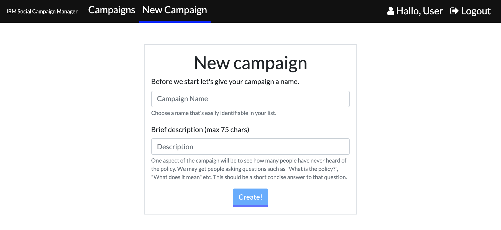

**Table of Contents**

[4 Usage demo](#demo)

[4.1 Social Campaign Manager](#social-campaign-manager)

[4.1.1 Creating a campaign](#creating-a-campaign)

[4.1.2 Engaging with the public](#engaging-with-the-public)

[4.1.3 Viewing the results](#viewing-the-results)

[4.1.4 Refining the campaign questions and answers](#refining-the-campaign-questions-and-answers)

[4.1.5 Editing a campaign](#editing-a-campaign)

[4.1.6 Deleting a campaign](#deleting-a-campaign)

Usage demo
====

Social Campaign Manager
-----------------------

This section will demonstrate typical use cases for the Social Campaign
Manager. It shows how to create, edit and delete a social media campaign
and what the various results on the campaign dashboard mean.

### Creating a campaign

First step, as shown in Figure 4.1, is to create a campaign by giving it
a name and description.

Figure 4.1 Create a draft campaign

After creating the draft the campaign will be ready to be filled with
content.

Figure 4.2 Campaign creation -- Campaign
questions

The campaign owner can start creating the questionnaire in the Questions
sections straight away in the as seen in Figure 4.2 These questions and
answers are data needed to implement Yes/No, multiple-choice and
free-form questions feature.

Figure 4.3 Campaign creation -- Adding
questions and answers

Next, in Figure 4.4 the campaign owner is presented with a screen with a
set of default questions that users may ask the chatbot at any given
time. These default questions are based on frequently asked questions
from the trial campaigns. As an example, when asking for the user's
consent, the user may ask "who is running this survey". This screen
allows policy makers to provide answers to these questions for the
chatbot to answer on their behalf. These questions are always present
for every new campaign.

Figure 4.4 Campaign creation -- Providing
answers to default questions around consent

Figure 4.5 allows the user to enter an introduction message. This
Campaign Chat Introduction is displayed to the participant after they
consent to the privacy statement. This can be a simple explanation of
the campaign or a further detailed message directed at the user. This
section also displays the campaign description. It will be displayed in
the list of campaigns together with their names if engaging with the
chatbot without specifying the campaign first. For example messaging the
Twitter account or going to the /chat path without specifying the
campaign id number.

Figure 4.5 Campaign creation - step 4 -- Creating campaign questions

Figure 4.6 Post Tweet and/or Publish Campaign

Lastly in Figure 4.6 there is a screen where the campaign owner can post
a tweet to social media and or publish the campaign. Posting the tweet
will send a tweet out from the host twitter account provided during
setup of the SCM.

Publishing saves the campaign to Watson, building the conversation dialog. It is used to update the campaign if edits are made. Publishing the campaign and posting a tweet are two separate and distinct actions. There is no need to post a Tweet as we will see in the section below.

## Engaging with the public

### Engaging with the public through generic chat window

Once the campaign is published, the participant is able to engage with the campaign by going to the generic chat window page. The page can be accessed through a url (YOUR-APP.mybluemix.net/#/chat/campaign-id-here), or through the Chat button on the campaign results page (displayed by the EDIT button, as shown in picture below).

Engaging with the campaign through chat requires the participant to begin the conversation by interacting with the chat window. The conversation begins with the chatbot stating the privacy policy.

### Engaging with the public through Slack

The SCM application supports Slack as a means of engaging the user the with the campaign. Once the Slack SCM app is integrated into the workspace of choice, the bot can be engaged in a channel by @mentioning the SCM bot user in a message. The user will respond with an introductory message and a link to where the application can be found in Slack.

The user can also visit the SCM chatbot Messages tab directly through the **Apps** section of their Slack application.

Once the user opens the app's Messages tab the bot will automatically reach out with an introduction message followed by a button to start the survey. The conversation can then be conducted by pressing buttons on multiple choice questions or simply typing the answer as with the Generic Chat Window and Twitter DMs below.

### Engaging with the public on Twitter

Once the campaign is created the system will send out a Tweet for
members of the public to see and reply to. Once they reply, the bot will
ask them to speak privately in direct messages.

Figure 4.7 A user being asked to speak in
direct messages after reply to the bot

Once in direct messages, the bot will ask for the user's consent to have
the questions recorded and ask them for some demographic answers. Once
complete the chatbot will give the user some context and begin asking
them the questions supplied as seen in Figure 4.8

Figure 4.8 A direct message conversation with
the chatbot

### Viewing the results

The results can be viewed at any time during the campaign. All the
analysis is performed in near real time and only takes a few moments for
the data to become available.

Opening the dashboard and selecting the campaigns tab, as in Figure
4.9, the policy maker is presented with a list of all available
campaigns.

Figure 4.9 Social Campaign Manager dashboard
viewing list of campaigns

Selecting one of the campaigns will bring the user to the results page,
initially showing the overall summary of the sentiment and emotion as
seen in Figure 4.10, alongside some basic metrics. Scrolling down the
campaign owner is shown the demographics of users who provided answers
to this social media campaign, including attributes extracted from their
twitter profiles, such as location in Figure 4.11.

Figure 4.10 Social Campaign Manager dashboard
viewing summary and metrics

Figure 4.11 Social Campaign Manager dashboard
viewing demographics

Further down the dashboard the results of all the analysis performed are
gathered by Watson and are subsequently aggregated into a chart for each
question. The chatbot received all the answers as free-form text. The
natural language processing services have been able to extract the
meaning in a way that allows us to deliver the same style of results you
will find in other online survey tools. Figure 4.12, Figure 4.13 and
Figure 4.14 show results of three styles of questions. Yes / No / Maybe,
multiple choice and a free form open text answers.

Figure 4.12 Social Campaign Manager dashboard
viewing question answers

Figure 4.13 Social Campaign Manager dashboard
viewing answers to multiple choice questions

Figure 4.14 Responses to a free form question

Figure 4.13 shows the users are being asked questions about the
coronavirus outbreak. Users have chosen options some said all of the
answers and some decided to choose none. Using a free form questions
like the one in Figure 4.14 can help the campaign owner get a sense of
the answers by extracting keywords and categorising the text to see what
people were talking about. Categorisation explores the Watson NLU
five-level taxonomy themes[^9] of the words in a user response. The
categories can reveal dimensions of words used by the responders and
find frequently occurring themes. The longer the given answer the better
the categorisation of the theme in the response.

The benefits of chatbots and free-form responses becomes clearer in the
following figures. Figure 4.15 shows the results of the analysis being
run on user responses to free form questions. These are questions that
are posed to the public when they choose a multiple-choice question.

Figure 4.15 Social Campaign Manager dashboard
viewing analysis of answers to why questions

Finally, the dashboard can extract responses from the public that the
bot has been unable to answer or understand. Figure 4.16 shows a
question which some users answers differently to what was asked. Many
people replied saying that masks "*don't help healthy people*" which was
not an available answer in the multiple choice answers list. This
section will show policy makers where users are struggling to understand
the questions or have different opinions to the subject. Using the edit
button on the campaign, policy makers can change the text to make it
clearer or add an example to make sure people understand what is being
asked of them.

Figure 4.17 Viewing user questions chatbot was
unable to answer

### Refining the campaign questions and answers

It is worth mentioning that when a policy maker creates a campaign using
the logic above, it is only the first step in making sure everything
runs smoothly. Chatbots at the end of the day are solutions that compare
words in a computer way rather than in a human way. What is meant by
this is, the campaign creation is just the first step in the refining
process. What the Social Campaign Manager is built for is updating the
campaign on the fly whenever the user sees fit. The campaign creators
are encouraged to spend some time with real questionnaire participants
to iron out potential misunderstandings that the campaign might cause
and analyse participant responses as they come. Conversations change
depending on context and other external factors. Misunderstandings are
inevitable, therefore each campaign owner is recommended to go through a
process of refining after initial conception.

### Editing a campaign

Any running campaign can be edited while it is running. The owner can
update the questions or add extra multiple-choice answer items to
questions. The campaign owner is able to go through the form in a
similar fashion as if they were creating the campaign. They just need to
publish the campaign and it will be instantly available through all
channels. The campaign name cannot be edited once the campaign is
running.

### Deleting a campaign

If a campaign is finished and/or it is no longer needed, it can be
deleted by pressing the *Delete Campaign* button at the bottom of the
edit campaign view below in the background in Figure 4.17. This will
open up a modal asking for user confirmation of the name of the campaign
being removed. Deleting a social media campaign removes all records
related to the questionnaire and all data collected throughout the
duration of the campaign.

Figure 4.18 Social Campaign Manager - Deleting
a campaign and all its data

[^9]: <https://cloud.ibm.com/docs/services/natural-language-understanding?topic=natural-language-understanding-categories-hierarchy>
